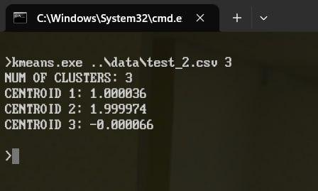

# K-Means++ in C

This is an implementation of the K-Means++ algorithm for 1D data in C99.


## Build the program

1. Create a `build` directory:
    ```
    mkdir build
    cd build
    ```

2. Generate a `Makefile` for Linux:
    ```
    cmake -G"Unix Makefiles" ..
    ```
    for Windows:
    ```
    cmake -G"MinGW Makefiles" ..
    ```

3. Build the executable:
    ```
    cmake --build .
    ```


## Usage

1. Linux:
    ```
    ./kmeans file_path cluster_num
    ```
2. Windows:
    ```
    kmeans.exe file_path cluster_num
    ```

## Screenshot

