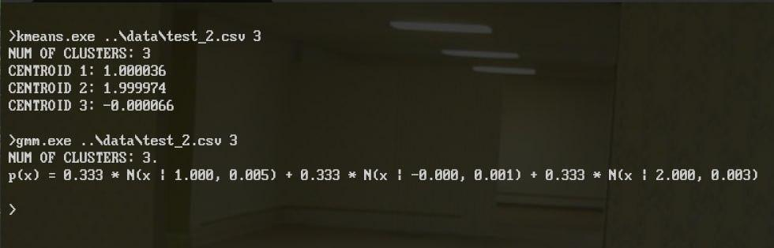

# Gaussian Mixture Models and K-Means++ in C

This is an implementation of the GMM and K-Means++ algorithms
for 1D data in C99.


## Build the program

1. Create a `build` directory:
    ```
    mkdir build
    cd build
    ```

2. Generate a `Makefile` for Linux:
    ```
    cmake -G"Unix Makefiles" ..
    ```
    for Windows:
    ```
    cmake -G"MinGW Makefiles" ..
    ```

3. Build the executable:
    ```
    cmake --build .
    ```


## Usage

```
./kmeans csv_file_path cluster_num
./gmm csv_file_path cluster_num
```

## Screenshot



## References

1. Deisenroth M.P., Faisal A.A., Ong C.S.
   *Mathematics for Machine Learning*.
   (2020)
2. Bishop C.M.
   *Pattern Recognition and Machine Learning*.
   (2006)

